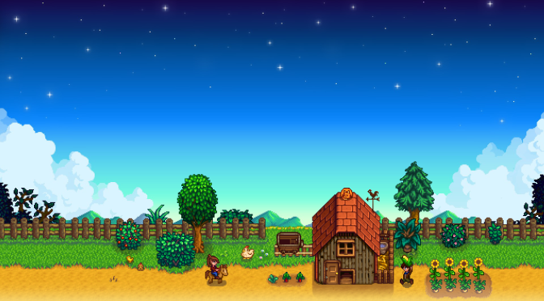
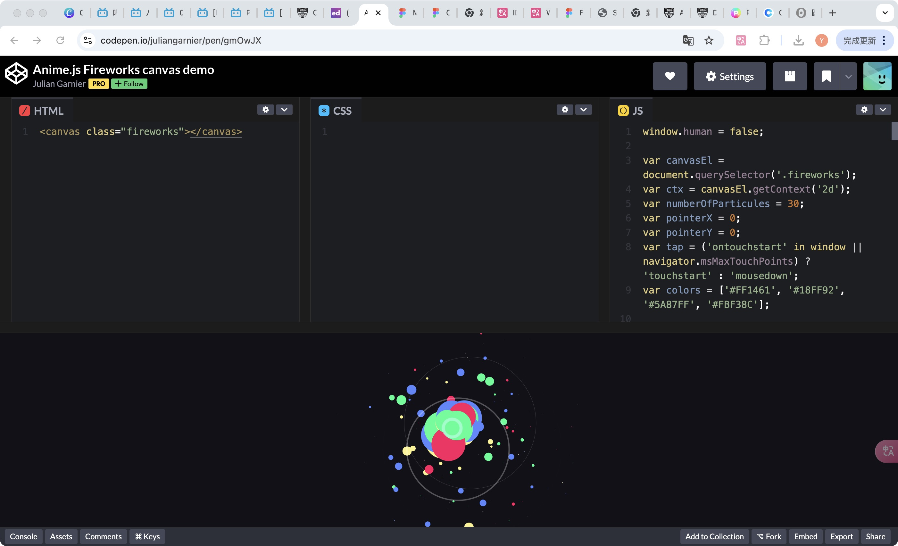

# Quiz 8 —— Pixel Art Scene Transitions in Stardew Valley
##  Part 1: Imaging Technique Inspiration
I am inspired by the pixelated day-to-night transitions in Stardew Valley, where the passage of time is conveyed through gradual color shifts and changes in environmental details. I hope to apply this time-based visual transformation in my project to emphasize rhythm and atmosphere. Additionally, Stardew Valley uses pixelated weather overlays—such as rain, snow, and storms—that affect both visuals and ambiance. Combining these layered effects can simulate emotional shifts in the environment. This approach enables a more immersive and emotionally resonant form of visual storytelling.

## Part 2: Coding Technique Exploration
An effective coding approach combines JavaScript’s requestAnimationFrame with linear color interpolation to simulate gradual sky color transitions. Using CSS filters and timed animations, the pixelated lighting changes seen in Stardew Valley can also be recreated. Additionally, HTML5 Canvas with JavaScript particles can generate rain or snow overlays with random motion and blur effects. These techniques work together to build rhythmic environmental storytelling, supporting the atmospheric goals of my project.
### Coding Technique Example
https://codepen.io/P1N2O/pen/pyBNzX
(Example of animated gradient background using JavaScript and CSS)
https://codepen.io/juliangarnier/pen/gmOwJX
（create rain/snow overlays with random motion and blur filters）

